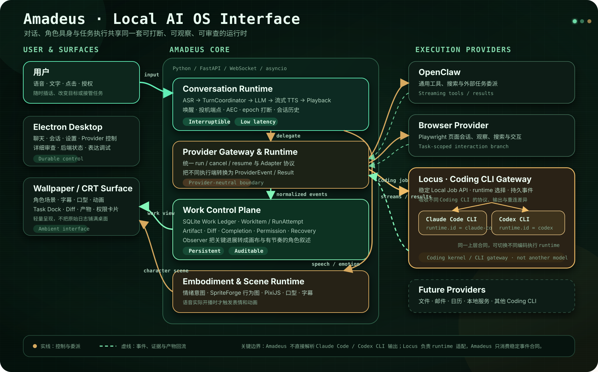

<div align="center">

# Amadeus

**A local desktop AI agent that can speak, inhabit your desktop, and get work done**

Amadeus brings interruptible voice, an embodied character, desktop scenes,<br>
and Coding / Browser Agents into one visible, resumable, user-steerable interface.

[简体中文](./README.md) · [English](./README_EN.md) · [Bilibili Demo](https://www.bilibili.com/video/BV1783G6hEYY/) · [Architecture](./assets/architecture-overview-crt.svg)

[](https://www.bilibili.com/video/BV1783G6hEYY/)

<sub>Click the image to watch the full 10-minute demo</sub>

</div>

> [!IMPORTANT]
> **The source code is being prepared and audited for release.** This repository currently documents the project, its demo, and release progress. It does not yet contain a buildable source distribution and is not a formal open-source release.

## What Amadeus is trying to solve

Voice assistants, desktop characters, and execution agents usually live in separate windows: one chats, one performs, and another works in a terminal or browser. Once a long-running task starts, it is also difficult to see what is happening, which permission is needed, or whether the work can recover after a failure.

Amadeus connects those experiences into one loop:

1. **Talk — communicate naturally:** speak or type, and interrupt the character as naturally as a human conversation.
2. **Embody — make the agent present:** voice, subtitles, lip sync, expression, and scene behavior share one playback timeline.
3. **Act — delegate real work:** OpenClaw, Browser, and Claude Code / Codex through Locus execute tasks in the background.
4. **Control — stay in charge:** progress, permissions, terminal output, files, diffs, and results remain visible; the user can pause, continue, retry, or take over.

Amadeus is not a chat window with a character pasted on top, nor a miniature IDE embedded in a wallpaper. It is closer to an interaction layer for a local AI OS: the character communicates and narrates, specialized agents execute, and the system owns state, boundaries, and recovery.

## Demo highlights

| Real-time conversation and performance | Scene-aware working state |
|---|---|
|  |  |
| Voice, subtitles, lip sync, and expression follow actual playback. | Background work drives character behavior, scene state, and result narration. |

The video demonstrates real-time voice, character performance, desktop scenes, Browser / OpenClaw tasks, and a paper-research flow. Coding-agent and game-companion work is still in development and will appear in later demos and source releases.

**[Watch the full demo on Bilibili →](https://www.bilibili.com/video/BV1783G6hEYY/)**

> [!NOTE]
> Characters, scenes, voices, and other third-party assets visible in the demo are used only to present the prototype. They are not part of the Amadeus open-source scope, and the public release will not include assets without redistribution rights.

## Core capabilities

| Area | Current internal build |
|---|---|
| **Interruptible real-time voice** | Shared microphone lifecycle, wake and continuous modes, Qwen3-ASR / SenseVoice paths, two-stage endpointing, AEC protection, and end-to-end interruption across LLM, TTS, and physical playback. |
| **Streaming expression timeline** | Multiple LLM backends, a hybrid first-sentence path, sentence-level streaming TTS, ordered concurrent playback, and dual subtitles; expressions and actions trigger when the corresponding audio actually begins. |
| **Character and desktop scenes** | SpriteForge graph state machine, PixiJS scene runtime, lip-sync and emotion timing, plus Wallpaper Engine / Lively bridges for desktop presentation. |
| **Provider Runtime** | OpenClaw, Browser Provider, and Locus sit behind one event and permission boundary, so the conversational model does not need to perform every tool task itself. |
| **Durable work control plane** | SQLite Work Ledger, separate RunAttempts, Continue / Retry / Resume, restart recovery, Task Dock, Artifact Registry, and structured diffs. |
| **User control and auditability** | Scoped permission objects, one-shot local export, stale-action protection, narrow local action routes, and a separation between narration and raw tool logs. |

<details>
<summary><strong>Expand technical details</strong></summary>

### Real-time conversation

- `TurnCoordinator` owns turn identity, confirmation and invalidation, chat state, TTS / playback epochs, and the moment playback actually completes.
- An interruption cancels model output, queued synthesis, and current audio together; epochs prevent stale text or audio from returning after cancellation.
- Streamed LLM output is parsed and segmented directly into TTS. Bounded queues, first-sentence priority, and playback-buffer estimates balance latency and natural continuity.
- Current backends include DeepSeek, Gemini, AWS Bedrock, OpenAI-compatible endpoints, and local model services. Low-latency speech is developed together with [Aqua-TTS](https://github.com/Lucas1479/Aqua-TTS).

### Embodiment and rendering

- The Python backend emits structured rendering events, while the frontend runtime owns high-frequency animation so backend scheduling jitter does not leak into character motion.
- Playback amplitude drives lip sync; sentence lifecycle drives subtitles, expressions, and speaking state.
- A wallpaper or rendering page can reconnect and restore the current expression, subtitle, canvas, speaking state, and behavior-graph node.

### Work and browsing

- One `WorkItem` can contain multiple `RunAttempts`; a successful process exit does not automatically mean that the user's goal is complete.
- The Completion Evaluator combines task state, files, diffs, and external artifacts to classify work as complete, partial, or blocked.
- A browser technical session can survive navigation, while each semantic task receives a short-lived Interaction Branch so an old page goal cannot contaminate a new request.

</details>

## Architecture

Click the diagram to open the original 1800 × 1120 version:

[](./assets/architecture-overview-crt.svg)

### How Locus relates to Claude Code and Codex

Locus is not a third coding agent or another model. It is Amadeus's stable gateway for Coding CLIs:

```text
Amadeus
  → Locus Local Job API
      → runtime.id = claude-code  → Claude Code CLI
      → runtime.id = codex        → Codex CLI
```

Its runtime-switching role resembles CC Switch, but its responsibility is closer to an execution kernel. Beyond selecting a CLI, Locus absorbs protocol and streaming-output differences and provides a stable Job API, persistent event sequence, and reconnection recovery. Amadeus therefore consumes one model of runtime state, tool events, terminal output, file artifacts, diffs, and final results.

## Current boundaries

| Scope | Status |
|---|---|
| Real-time conversation, embodiment, desktop scenes | Running in the internal build and shown in the demo |
| OpenClaw / Browser Provider | End-to-end prototype and work control plane implemented |
| Locus → Claude Code / Codex | Adapter and runtime selection implemented; public configuration and acceptance work remain |
| Automatic worktree isolation | Code and offline tests complete; default remains off pending full machine acceptance |
| General screen / window / camera vision | Browser observation works; general visual context is still being consolidated |
| VN Player and game companionship | Backend MVP exists; frontend controls and a general Hooker bridge remain in development |
| Installable public release | Dependency, asset, model, configuration, and license boundaries are not yet complete |

“Implemented internally” does not mean “packaged as a reproducible public release.” The first source release will prioritize clear boundaries, honest configuration, and a minimal runnable path.

## Open-source release progress

- [x] Create the public repository
- [x] Publish bilingual project pages, demo images, and the system architecture
- [ ] Freeze the feature and dependency boundary for the first public release
- [ ] Complete secret and third-party license audits
- [ ] Remove or replace personal character, voice, model, and local runtime assets
- [ ] Prepare installation, configuration examples, and minimal usage documentation
- [ ] Publish the first runnable source version
- [ ] Select and publish the open-source license

The first source version is expected to include the core runtime, required configuration examples, and basic usage documentation. API keys, tokens, personal configuration, session data, model weights, logs, caches, and assets without redistribution rights will not be included.

## Repository history and license

The public commit history starts with open-source preparation. Earlier internal development history remains in a non-public repository; the reviewed public source will be committed here as a deliberately prepared release.

No source code or open-source license has been published yet. Until a license is announced with the first source release, do not treat this repository as granting permission to use, modify, or redistribute code or media assets.

## Related projects

- [Aqua-TTS](https://github.com/Lucas1479/Aqua-TTS): a GPT-SoVITS V3 real-time inference runtime optimized for Amadeus
- [GPT-SoVITS](https://github.com/RVC-Boss/GPT-SoVITS): the speech-synthesis inference foundation

Star or Watch this repository to follow the source release.

---

<div align="center"><em>El Psy Kongroo.</em></div>
